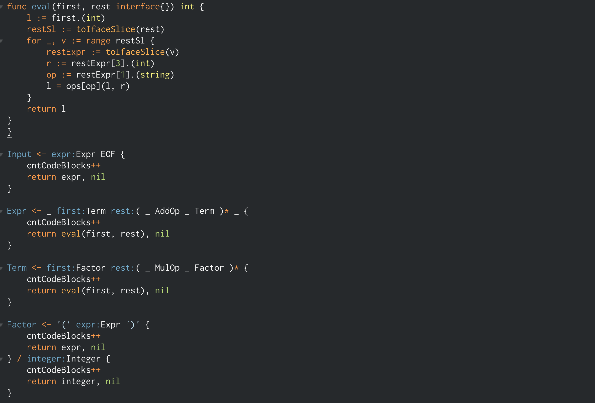

# pigeon-sublime
Sublime Text 3 Syntax for mna/pigeon

This is a work in progress and does not fully support all of the syntax that [pigeon](https://github.com/mna/pigeon) will accept. 

Currently this will auto-detect either the `.peg` or `.pigeon` extensions. 

example:

